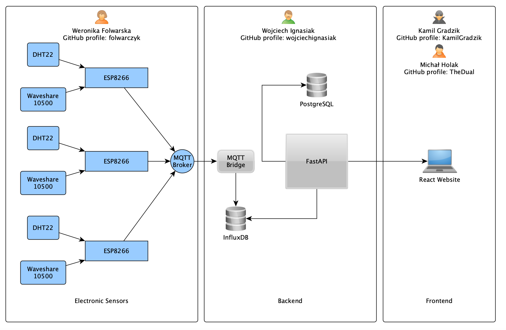
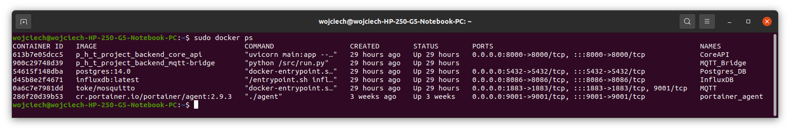
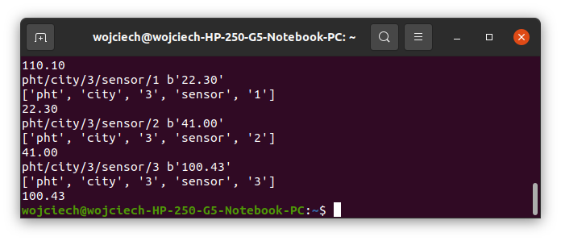
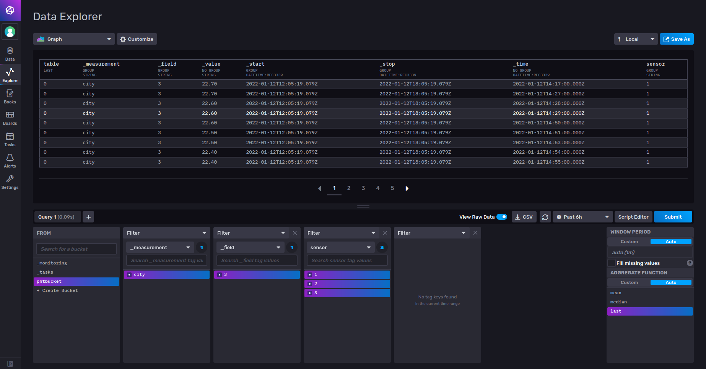
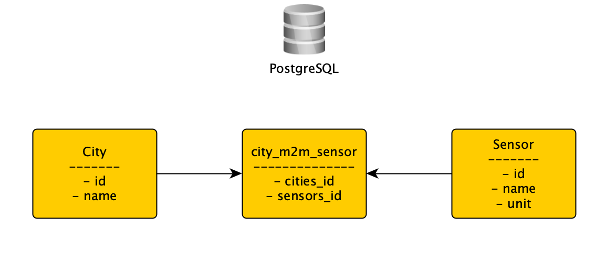
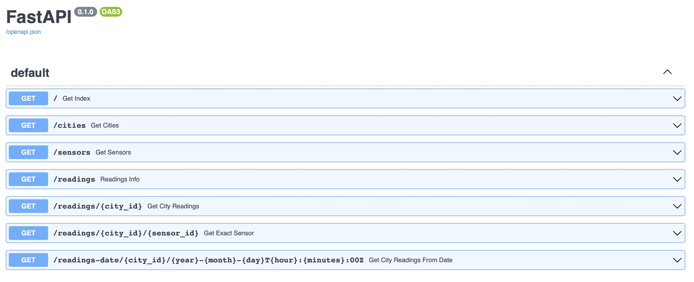

# **PHT Weather Station - Backend**

## **General info**

<br>

    PHT is a project created by group of students. The project goal was to create a Service that will measure
    temperature, air humidity and pollution in the cities of Częstochowa, Myszków and Krzepice
    located in Silesia in Poland.

<br>

## **Setup - M1 Mac **

    1. Install:

        Docker
        Docker-compose

    2. Open P_H_T_Project_Backend/pht_backend folder.
    3. Open requirements.txt file and replace "psycopg2-binary" to just "psycopg2" and save changes.
    2. Start Terminal.
    3. Get to P_H_T_Project_Backend folder.
    4. Start command:

        ./build.sh

    5. Done

## **Setup - Linux Ubuntu **

    1. Install:

        Docker
        Docker-compose

    2. Start Terminal
    3. Get to P_H_T_Project_Backend folder.
    4. Start command:

        sudo ./build-linux.sh

    5. Done

## **Project Structure Diagram**

<br>



<br>

## **How it works? - Backend**

<br>

#### **Docker-compose**

    Whole Backend layer has been built on Docker-compose containers technology:



<br>

#### **MQTT Bridge**

    MQTT Bridge caches data with structure "pht/city/{city_id}/sensor/{sensor_id}, "sensor_data""
    send by electronic sensors on {ip_adress}:1883 adress. Then MQTT breake the structure into InfluxDB topics:



<br>

#### **InfluxDB**

    MQTT correctly transfers data and topics structure to InfluxDB and by Explore tab we can see collected data:



<br>

#### **PostgreSQL**

    We use PostgreSQL to store the names of cities, sensors and units of measurement.
    In addition, we structure them by, for example, giving them identification numbers, which help us to provide endpoints.
    These endpoints only use PostgreSQL and show the adopted data organization:



<br>

#### **FastAPI**

    We decided to use FastAPI due to its speed and lightness, which is perfect for our small project.
    In FastAPI we connect to PostgreSQL and InfluxDB to provide structured data in the form of endpoints.
    You can check all enpoints on {ip_adress}/docs.
    Here is an example:



<br>

## **Endpoint list:**

<br>

Endpoint:

```
/cities
```

Example request:

**`http://178.43.161.159/cities`**

Example success response:

```json
{
  "cities": [
    {
      "id": 1,
      "city_name": "Czestochowa",
      "sensor_list": [1, 2, 3]
    },
    {
      "id": 2,
      "city_name": "Myszkow",
      "sensor_list": [1, 2, 3]
    },
    {
      "id": 3,
      "city_name": "Krzepice",
      "sensor_list": [1, 2, 3]
    }
  ]
}
```

Example error response:

```json
{
  "error_code": "4040",
  "error_message": "Internal server error"
}
```

<br><br>

### **GET sensors**

Endpoint:

```
/sensors
```

Example request:

**`http://178.43.161.159/sensors`**

Example success response:

```json
{
  "sensors": [
    {
      "id": 1,
      "sensor_name": "temperature",
      "unit": "Celsius degrees"
    },
    {
      "id": 2,
      "sensor_name": "humidity",
      "unit": "percent"
    }
    {
      "id": 3,
      "sensor_name": "pollution",
      "unit": "PM2.5"
    }
  ]
}
```

Example error response:

```json
{
  "error_code": "4040",
  "error_message": "Internal server error"
}
```

<br><br>

### **GET city readings**

Endpoint:

```
/readings/{city_id}
```

Example request:

**`http://178.43.161.159/readings/1`**

Example success response:

```json
{
  "temperature": "20",
  "humidity": "60",
  "pollution": "10"
}
```

Example error response:

```json
{
  "error_code": "4041",
  "error_message": "City does not exist"
}
```

<br><br>

### **GET city exact sensor readings**

Endpoint:

```
/readings/{city_id}/{sensor_id}
```

Example request:

**`http://178.43.161.159/readings/1/0`**

Example success response:

```json
{
  "humidity": "60"
}
```

Example error response:

```json
{
  "error_code": "4042",
  "error_message": "Sensor does not exist"
}
```

<br><br>

### **GET city readings from given date**

Date format (iso8601): `YYYY-MM-DDThh:mm:ssZ`\
Date example: `2021-10-22T00:09:00Z`

Endpoint:

```
/readings-date/{city_id}/{year}-{month}-{day}T{hour}:{minutes}:00Z
```

Example request:

**`http://178.43.161.159/readings-date/1/2021-10-22T00:09:00Z`**

Example success response:

```json
{
  "temperature": "20",
  "humidity": "60",
  "pollution": "10"
}
```

Example error response:

```json
{
  "error_code": "4043",
  "error_message": "City does not exist or date has been given in wrong format"
}
```
